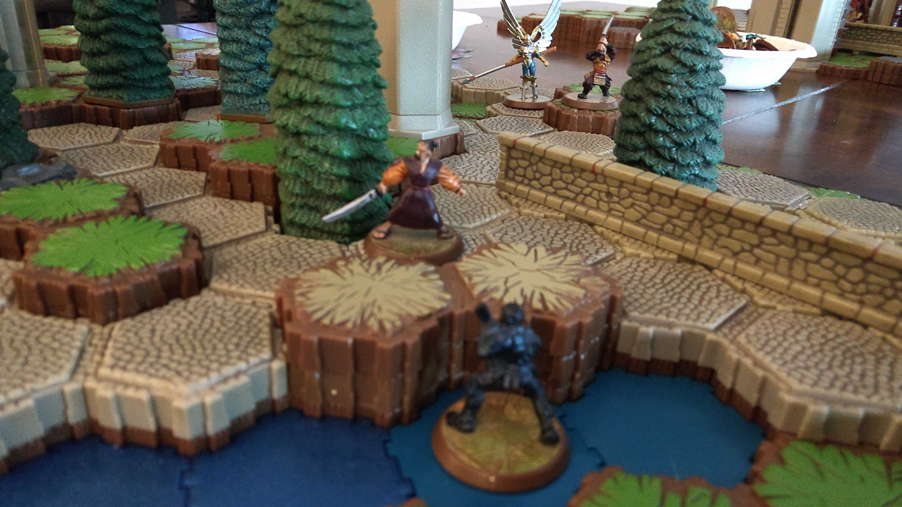
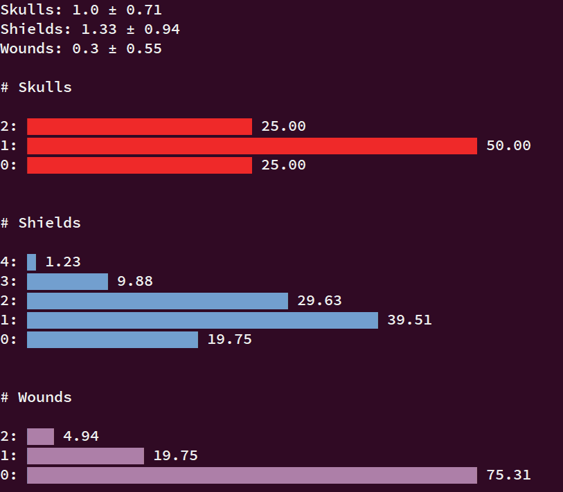
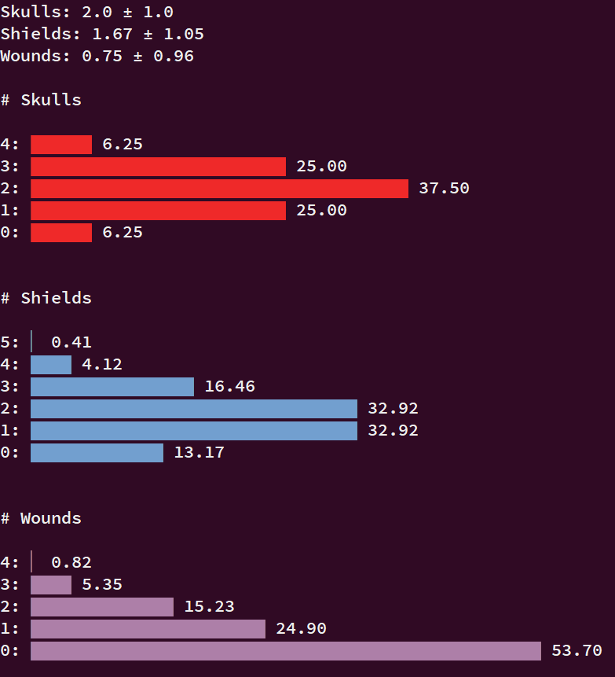

# Heroscape Statistics

A simple tool for generating the probability distributions of skulls, shields and wounds

| Dependencies                                                 |
| ---                                                          |
| Bash                                                         |
| Python                                                       |
| `pip install numpy`                                          |
| `pip install numpy`                                          |
| `pip install unittest`                                       |
| [`pip install termgraph`](https://github.com/mkaz/termgraph) |

| Script      | Board Game Geek                                                              |
| ---         | ---                                                                          |
| `heroscape` | https://boardgamegeek.com/boardgame/11170/heroscape-master-set-rise-valkyrie |

| Usage              | Description                                                                                               |
| ---                | ---                                                                                                       |
| `heroscape a b`    | Shows the expected number of skulls, shields and wounds when rolling `a` attack dice and `b` defense dice |
| `python *tests.py` | Runs the tests                                                                                            |

## Example

Lone Microcorp Agent is choosing whether to attack a Tagawa Samurai or Raelin. If he can inflict some damage, the rest of his team may stand a chance. His choices are:

 - Attack Raelin. He has 2 attack, she has 3 + height advantage is 4 defense: `heroscape 2 4`

 - Take height advantage and attack Tagawa. He has 2 + height advantage + sighting is 4 attack, the samurai has 5 defense: `heroscape 4 5`

The agent's mission is to do damage and moving adjacent to the samurai is 20% more likely to do at least 1 wound (ie: not get 0 wounds): 

 - 46.3% vs 24.69%
